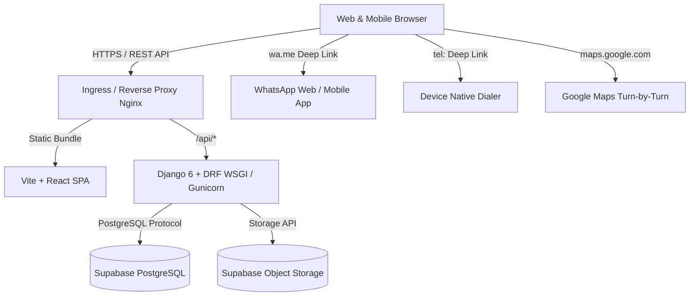

# Nearza — System Architecture

Nearza is a hyperlocal product discovery, multi-shop price comparison, and merchant communication platform connecting local retail stores with neighborhood consumers.

---

## 1. High-Level Architecture

---

## 2. Frontend Architecture

- **Framework**: React 19 with Vite 8.
- **Styling**: Tailwind CSS v4 (`@tailwindcss/vite`) strictly styled in a modern, accessible **white + sky-blue** theme.
- **Routing**: React Router v7 with route pipelines for public, customer discovery, merchant portal, and admin governance.
- **Layouts**:
  - `MainLayout`: Global sticky navbar, location indicator, mobile bottom dock navigation, and footer.
  - `MerchantLayout`: Dedicated merchant management workspace with desktop sidebar, mobile drawer, and status header.
- **Global Contexts**:
  - `AuthContext`: Manages user credentials, JWT storage, role decoding, and automatic session expiration broadcasts.
  - `LocationContext`: Manages browser geolocation with explicit user permission, reverse geocoding via OpenStreetMap, distance computation via Haversine formula, and locality switching.
  - `ToastContext`: Floating feedback toasts for user actions (favorites saved, copies to clipboard, errors).

---

## 3. Backend Architecture

- **Framework**: Django 6.0 with Django REST Framework.
- **Authentication**: Stateless JSON Web Tokens (`rest_framework_simplejwt`) with 15-minute access token lifespan, 7-day refresh token rotation, and token blacklisting.
- **App Structure**:
  - `apps.accounts`: Custom user model (email as primary identifier), RBAC permission classes (`IsCustomer`, `IsMerchant`, `IsAdminUser`, `IsObjectOwner`, `IsShopOwner`), JWT lifecycle, profile management.
  - `apps.shops`: Physical merchant storefront profiles, geographic coordinates (latitude, longitude), operating hours, verification status pipeline (`pending`, `approved`, `rejected`, `suspended`).
  - `apps.products`: Global product catalog, department categories, and `ShopProduct` multi-merchant offerings with prices and live inventory status.
  - `apps.inventory`: Historical inventory audits, last-updated tracking, and automatic inventory confidence scoring.
  - `apps.favorites`: Customer saved products and saved neighborhood shops with proximity calculations.
  - `apps.notifications`: Targeted price drops, restocks, and deal notices with read/unread tracking.
  - `apps.reports`: User reporting workflow for incorrect prices, wrong stock, fake shops, or inappropriate content.
  - `apps.reviews`: Customer shop reviews with 1–5 star ratings, automated shop average rating recalculation, and moderation.
  - `apps.analytics`: Anonymous customer interaction telemetry tracking product views, shop views, WhatsApp clicks, call clicks, and directions clicks.
  - `apps.admin_panel`: Platform governance, merchant verification queue, product/category moderation, user suspension, and immutable audit logs.

---

## 4. Communication Architecture

Nearza provides direct, frictionless contact between consumers and local store owners without requiring custom chat infrastructure:

1. **Phone Dialing (`Call Merchant`)**:
   - Phone numbers are normalized to international E.164 format (`+91...`).
   - Opens the device dialer via `tel:` links.
   - Desktop fallback: Copies formatted number to clipboard with user feedback.
2. **WhatsApp Inquiries (`WhatsApp Merchant`)**:
   - Generates contextual deep links (`https://wa.me/<number>?text=<encoded_message>`).
   - Pre-fills inquiries with the specific product name, price, and shop name:
     `"Hi, I found [Product Name] on Nearza at [Shop Name]. Is it currently available at ₹[Price]?"`
   - RFC 3986 URL-encoded; never exposes merchant credentials.
3. **Turn-by-Turn Directions (`Get Directions`)**:
   - Generates Google Maps directions links using user origin coordinates and merchant destination coordinates.
