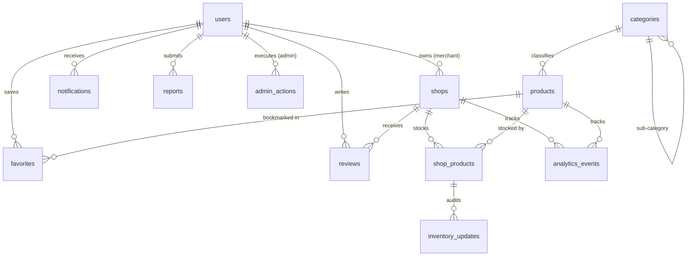

# Nearza — Database Architecture & Schema

Nearza utilizes **Supabase PostgreSQL** as its primary persistent relational store, managed via Django ORM migrations and optimized for high-read geospatial queries.

---

## 1. Entity Relationship Diagram

---

## 2. Table Specifications

### `users`
- `id`: `UUID` (Primary Key, default `gen_random_uuid()`)
- `email`: `VARCHAR(255)` (Unique, Indexed)
- `full_name`: `VARCHAR(150)`
- `phone`: `VARCHAR(15)`
- `role`: `VARCHAR(20)` (`customer`, `merchant`, `admin`)
- `is_active`: `BOOLEAN` (Default `True`, indexed)
- `is_staff`: `BOOLEAN`
- `is_superuser`: `BOOLEAN`
- `created_at`, `updated_at`: `TIMESTAMPTZ`

### `shops`
- `id`: `UUID` (Primary Key)
- `merchant_id`: `UUID` (FK -> `users.id`, `ON DELETE CASCADE`)
- `name`: `VARCHAR(200)`
- `slug`: `VARCHAR(220)` (Unique, Indexed)
- `description`: `TEXT`
- `address`: `TEXT`
- `city`: `VARCHAR(100)` (Indexed)
- `state`: `VARCHAR(100)`
- `pincode`: `VARCHAR(10)` (Indexed)
- `latitude`: `DECIMAL(10, 8)` (Geographic coordinate)
- `longitude`: `DECIMAL(11, 8)` (Geographic coordinate)
- `phone`: `VARCHAR(15)`
- `whatsapp_number`: `VARCHAR(15)`
- `verification_status`: `VARCHAR(20)` (`pending`, `approved`, `rejected`, `suspended`, Indexed)
- `avg_rating`: `DECIMAL(3, 2)` (Default `0.00`)
- `total_reviews`: `INTEGER` (Default `0`)
- `is_active`: `BOOLEAN` (Default `True`, Indexed)

### `categories`
- `id`: `UUID` (Primary Key)
- `name`: `VARCHAR(100)`
- `slug`: `VARCHAR(120)` (Unique, Indexed)
- `description`: `TEXT`
- `icon_url`: `VARCHAR(500)`
- `parent_id`: `UUID` (Self-referential FK, nullable)
- `sort_order`: `INTEGER`
- `is_active`: `BOOLEAN`

### `products`
- `id`: `UUID` (Primary Key)
- `name`: `VARCHAR(255)` (Indexed)
- `slug`: `VARCHAR(280)` (Unique, Indexed)
- `description`: `TEXT`
- `brand`: `VARCHAR(100)` (Indexed)
- `category_id`: `UUID` (FK -> `categories.id`)
- `image_url`: `VARCHAR(500)`
- `unit`: `VARCHAR(20)` (e.g. `kg`, `g`, `L`, `ml`, `piece`, `pack`)
- `unit_value`: `DECIMAL(10, 2)`
- `is_active`: `BOOLEAN` (Indexed)

### `shop_products` (Inventory & Multi-Merchant Offerings)
- `id`: `UUID` (Primary Key)
- `shop_id`: `UUID` (FK -> `shops.id`, Indexed)
- `product_id`: `UUID` (FK -> `products.id`, Indexed)
- `price`: `DECIMAL(10, 2)` (Indexed)
- `quantity`: `INTEGER`
- `stock_status`: `VARCHAR(20)` (`in_stock`, `low_stock`, `out_of_stock`, Indexed)
- `sku`: `VARCHAR(50)`
- `merchant_notes`: `TEXT`
- `is_active`: `BOOLEAN`
- `last_updated`: `TIMESTAMPTZ` (Auto updated on changes)
- **Constraint**: Unique combination of `(shop, product)`.

### `inventory_updates`
- `id`: `UUID` (Primary Key)
- `shop_product_id`: `UUID` (FK -> `shop_products.id`)
- `old_quantity`, `new_quantity`: `INTEGER`
- `old_price`, `new_price`: `DECIMAL(10, 2)`
- `old_stock_status`, `new_stock_status`: `VARCHAR(20)`
- `source`: `VARCHAR(30)` (`merchant_dashboard`, `pos_import`, `bulk_csv`, `api`)
- `created_at`: `TIMESTAMPTZ`

### `favorites`
- `id`: `UUID` (Primary Key)
- `user_id`: `UUID` (FK -> `users.id`)
- `product_id`: `UUID` (FK -> `products.id`, nullable)
- `shop_id`: `UUID` (FK -> `shops.id`, nullable)
- `favorite_type`: `VARCHAR(10)` (`product`, `shop`)
- **Constraints**: Unique `(user, product)` where product is not null; unique `(user, shop)` where shop is not null.

### `reports`
- `id`: `UUID` (Primary Key)
- `reporter_id`: `UUID` (FK -> `users.id`)
- `report_type`: `VARCHAR(20)` (`product`, `shop`, `review`, `price`)
- `target_id`: `UUID`
- `reason`: `VARCHAR(100)` (`incorrect_price`, `wrong_stock`, `fake_shop`, `inappropriate_content`, `other`)
- `description`: `TEXT`
- `status`: `VARCHAR(20)` (`pending`, `reviewed`, `resolved`, `dismissed`)
- `resolved_by_id`: `UUID` (FK -> `users.id`, nullable)
- `resolution_notes`: `TEXT`

### `reviews`
- `id`: `UUID` (Primary Key)
- `user_id`: `UUID` (FK -> `users.id`)
- `shop_id`: `UUID` (FK -> `shops.id`)
- `rating`: `SMALLINT` (1–5)
- `comment`: `TEXT`
- `is_approved`: `BOOLEAN` (Default `True`)
- **Constraint**: Unique `(user, shop)` — one review per customer per shop.

### `admin_actions` (Audit Log)
- `id`: `UUID` (Primary Key)
- `admin_id`: `UUID` (FK -> `users.id`)
- `action_type`: `VARCHAR(50)` (Indexed)
- `target_type`: `VARCHAR(50)` (Indexed)
- `target_id`: `UUID` (Indexed)
- `details`: `JSONB`
- `created_at`: `TIMESTAMPTZ` (Indexed)

---

## 3. Inventory Confidence Scoring

Inventory confidence calculates a trust score (0–100%) indicating how recently a merchant verified their product stock:

- **< 24 Hours**: **High Confidence (90% – 100%)**
- **1 – 3 Days**: **Good Confidence (75% – 89%)**
- **4 – 7 Days**: **Moderate Confidence (50% – 74%)**
- **> 7 Days**: **Unverified / Low Confidence (< 50%)**

Every time a merchant edits price, quantity, or status in the Merchant Dashboard, `last_updated` is refreshed and an `inventory_updates` audit row is created.
